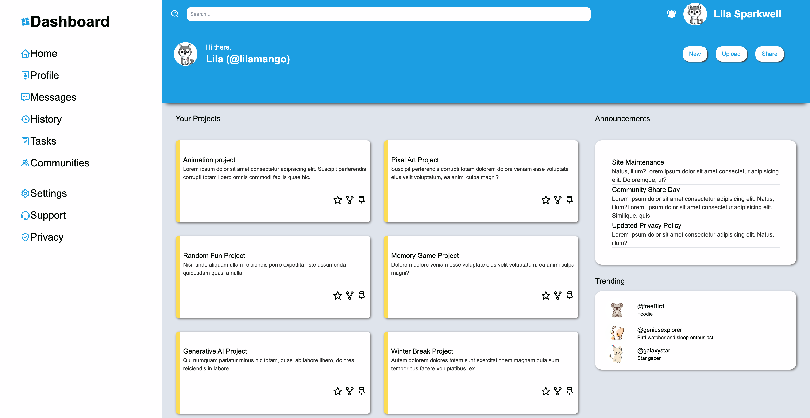

# Admin Dashboard

This is my implementation of the admin dashboard project for The Odin Project. Try it [here](https://giahenville.github.io/admin-dashboard/)

## Description:

This is a design that I made to practice my CSS Grid skills. This dashboard displays the user's projects, includes a sidebar for naviagation, and an announcements/trending section.

## Skills I learned:

* Implementing various hover effects
* Utilizing CSS Grid and Flexbox together, learning when to use each over the other 
* Utilizing CSS Grid for element alignment and developing a partially responsive design
* Defining rows and columns of different sizes using grid-template-rows and grid-template-columns
* Maintaining consistent styling and easy modification through the use of CSS variables
* Creating rounded profile images

## Improvements:

* Implement a fully responsive design

